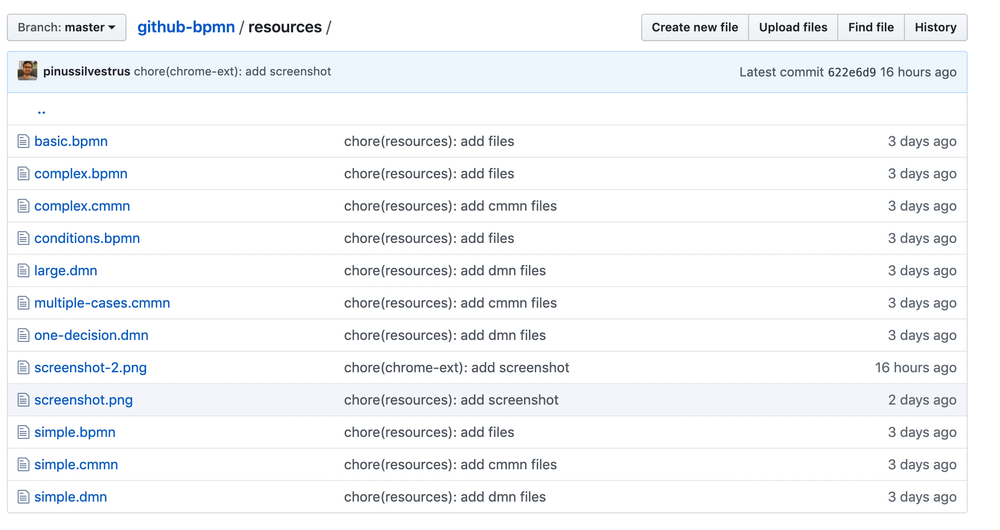
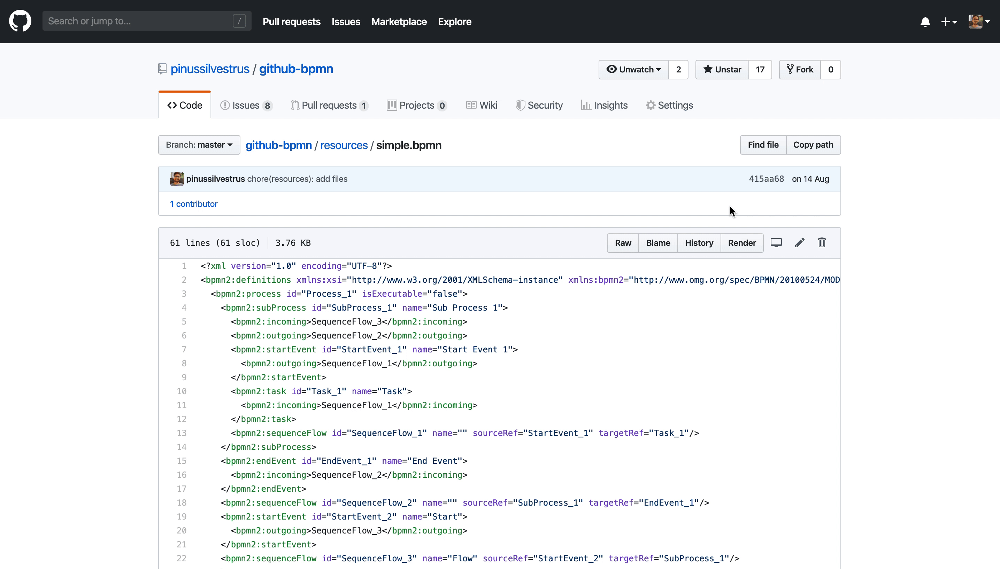

# chrome-ext

> A chrome extension that renders BPMN, CMMN and DMN files on GitHub on hover

## Setup

Open the [Extensions view](https://support.google.com/chrome_webstore/answer/2664769?hl=en) in Chrome and click on `Load unpacked`, locate the repository and select the `chrome-ext` folder.

Preview BPMN, CMMN and DMN files directly via tooltip.

Furthermore, preview them on the file details page.

