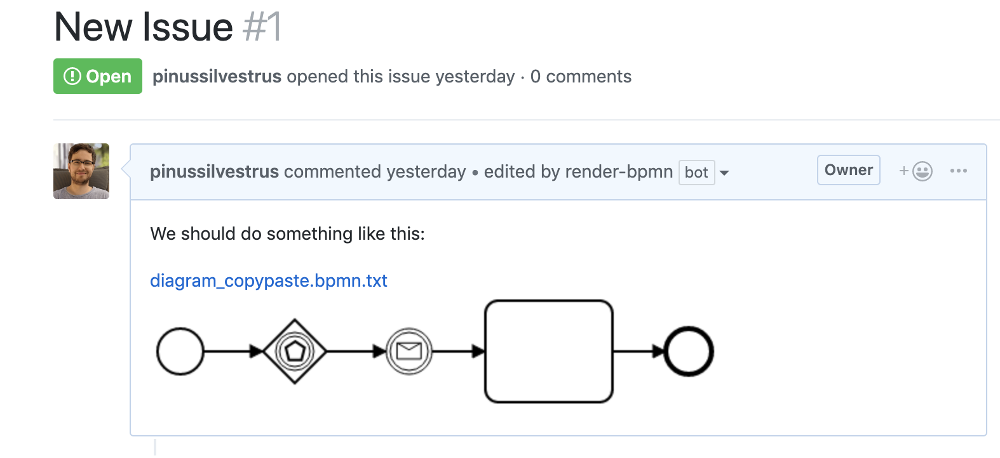

# render-bpmn

> A GitHub App built with [Probot](https://github.com/probot/probot) that automatically renders BPMN files on GitHub Issues and Pull Requests. 



## Setup

```sh
# Install dependencies
npm install

# Run the bot
npm start
```

This will start the Probot App on http://localhost:3000 and be ready for registering. __Note:__ on additional start after registering could be needed work properly, causing registering delays to the smee.io proxy.

## Contributing

If you have suggestions for how probot could be improved, or want to report a bug, open an issue! We'd love all and any contributions.

For more, check out the [Contributing Guide](CONTRIBUTING.md).

## License

[MIT](LICENSE) © 2019 Niklas Kiefer <niklas.kiefer@camunda.com>
