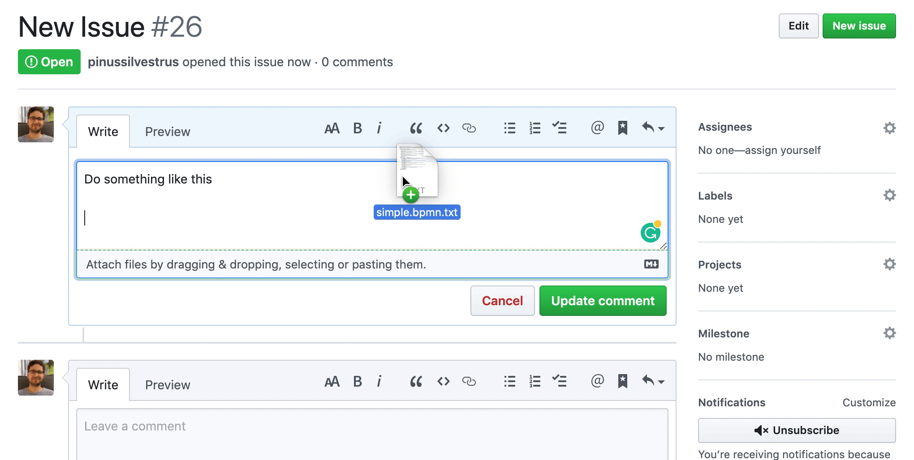

> Note: Currently it's not possible to upload `.bpmn` files via drag and drop on GitHub. Attaching a `.txt` extension at the end can be a workaround.

# render-bpmn

[](https://travis-ci.org/pinussilvestrus/github-bpmn)

A GitHub App built with [Probot](https://github.com/probot/probot) that automatically renders BPMN files on GitHub Issues and Pull Requests. 



## Setup

The application is connected to GitHub as a [GitHub app](https://developer.github.com/apps/). Get started by creating a GitHub app, either via the development setup or using [manual configuration steps](#manual-steps) as documented below.


### Automatic Development Setup

Checkout, install and run the application in development mode as shown below:

```bash
git clone git@github.com:pinussilvestrus/github-bpmn.git
cd probot-app
npm install
npm run dev
```

Access the application on [`localhost:3000`](http://localhost:3000). [Probot](https://probot.github.io/), the app framework used by the render-bpmn application, helps you to create your GitHub app. Give your app a unique name and remember it.

Once the setup completes probot writes the basic app configuration to the `probot-app/.env` file. Go to your app page on GitHub, fetch client ID and client secret and add these properties to the `.env` file as `GITHUB_CLIENT_ID` and `GITHUB_CLIENT_SECRET`, respectively.

__Note:__ on additional start after registering could be needed work properly, causing registering delays to the smee.io proxy.

### Manual Steps

[Create your GitHub app](https://github.com/settings/apps/new) and configure it according to the [provided app mainfest](../probot-app/app.yml).

Create a `.env` file with the required configuration variables as provided by GitHub. Use the [provided example](../probot-app/.env.example) as a starting point.

## Deploy

Tryout the Heroku Deploy Button below and [follow the setup instructions](https://probot.github.io/docs/deployment/#heroku).

[](https://heroku.com/deploy?template=https://github.com/pinussilvestrus/github-bpmn)


## Contributing

If you have suggestions for how probot could be improved, or want to report a bug, open an issue! We'd love all and any contributions.

For more, check out the [Contributing Guide](CONTRIBUTING.md).

## License

[MIT](LICENSE) © 2019 Niklas Kiefer <niklas.kiefer@camunda.com>
